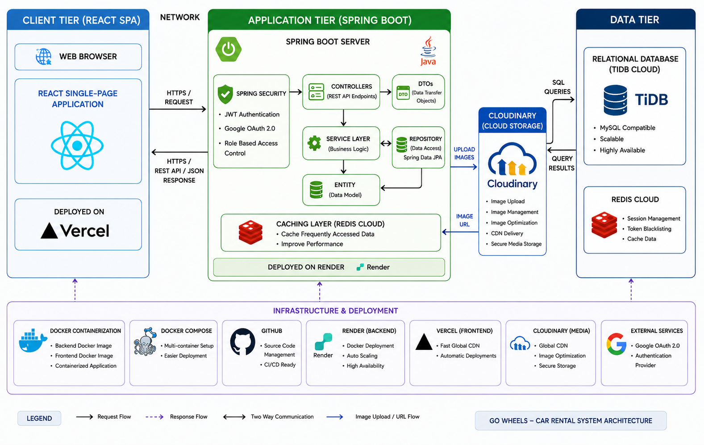

<table align="center">
  <tr>
    <td valign="middle">
      
    </td>
    <td valign="middle">
      <h1 style="margin: 0 0 0 12px;">
        GoWheels - Car Rental System
      </h1>
    </td>
  </tr>
</table>

<p align="center">
  A Full Stack Car Rental Management Platform built using Spring Boot, React, MySQL, Docker, and Redis.
</p>

---

# 🚀 Live Demo

* 🌐 **Frontend:** https://go-wheels-gamma.vercel.app/
* ⚙️ **Backend:** https://gowheels-w4uy.onrender.com

---

# 📖 Project Overview

GoWheels is a modern Car Rental Management System that enables customers to browse available vehicles, rent cars online, and manage their bookings seamlessly.

The platform provides secure authentication, role-based access control, vehicle management, Cloudinary-powered image management, rental tracking, Redis-powered caching, and cloud deployment for high performance and scalability.

---

# 🛠️ Tech Stack

## 🎨 Frontend

<p>
  
  
  
  
  
</p>

* HTML5
* CSS3
* Bootstrap 5
* JavaScript (ES6+)
* React.js
* Axios

**Deployment:** Vercel

---

## ⚙️ Backend

<p>
  
  
  
</p>

* Java 21
* Spring Boot
* Spring Security
* JWT Authentication
* Google OAuth 2.0
* Spring Data JPA
* Hibernate ORM
* REST APIs
* Cloudinary Image Storage
* Maven

**Deployment:** Render

---

## 🗄️ Database

<p>
  
</p>

* TiDB Cloud
* MySQL Compatible Database

---

## ⚡ Caching

<p>
  
</p>

* Redis Cloud
* Distributed Caching
* Performance Optimization

---


## ☁️ Cloud Storage

<p>
  
</p>

* Cloudinary
* Secure Image Uploads
* Cloud-Based Media Storage
* Optimized Image Delivery
* Automatic Image Compression
* CDN Powered Image Access

---

## 🐳 DevOps & Tools

<p>
  
  
  
</p>

* Docker
* Docker Compose
* Git
* GitHub

---

## 🧪 API Testing

<p>
  
</p>

* Postman

---

# 🏗️ System Architecture

<p align="center">
  
</p>

### 🔄 Architecture Overview

The application follows a multi-layer architecture that ensures scalability, maintainability, and security.

### 🖥️ Client Layer

* React Single Page Application (SPA)
* Responsive UI
* Axios API Communication
* JWT Token Handling

### ⚙️ Application Layer

* Spring Boot REST APIs
* Controller Layer
* Service Layer
* Repository Layer
* DTO Layer
* Business Logic Layer
* Redis Cache Layer
* Cloudinary Integration

### 🗄️ Data Layer

* TiDB Cloud Database
* MySQL Compatible Storage
* Hibernate ORM
* Spring Data JPA

### ☁️ Infrastructure Layer

* Docker Containers
* Render Deployment
* Vercel Deployment
* Redis Cloud

---

# ✨ Features

## 👤 Customer Features

### 🔐 Authentication & Authorization

* User Registration
* User Login
* JWT Authentication
* Google OAuth 2.0 Login
* Secure Password Encryption
* Role-Based Access Control

### 🚗 Car Browsing

* Browse Available Cars
* Search Cars
* Filter Cars by Category
* View Car Details
* Check Vehicle Availability

### 📅 Car Rental Management

* Rent Cars Online
* Select Rental Duration
* Track Active Rentals
* View Rental History
* Manage Current Bookings

### 👤 Profile Management

* View Profile Information
* Update Personal Details
* Manage Account Information

---

## 🛡️ Admin Features

### 🚘 Car Management

* Add New Cars
* Update Car Details
* Delete Cars
* Manage Vehicle Availability
* Upload and Manage Car Images via Cloudinary Integration

### 📋 Rental Management

* View Customer Rentals
* Monitor Active Rentals
* Track Rental History
* View Booking Details

### 👤 Profile Management

* View Admin Profile
* Update Profile Information

---

# ⚡ Performance Features

### Redis Cloud Integration

* Faster Data Retrieval
* Reduced Database Load
* Frequently Accessed Data Caching
* Improved Response Time
* Better Scalability

### Cloudinary Optimization

* Cloud-Based Media Delivery
* CDN Accelerated Image Loading
* Automatic Image Compression
* Optimized Bandwidth Usage
* Faster Frontend Rendering

### Backend Optimization

* Efficient JPA Queries
* Hibernate ORM
* DTO-Based Data Transfer
* RESTful API Design
* Optimized Database Access

---

# 🔐 Security Features

* Spring Security Integration
* JWT Token Authentication
* Google OAuth 2.0 Authentication
* BCrypt Password Encryption
* Role-Based Authorization
* Protected REST Endpoints
* Secure CORS Configuration
* Input Validation
* Global Exception Handling
* Secure Cloudinary Media Storage
* Protected Image Upload APIs

---

# 📂 Project Structure

```text
GoWheels
│
├── GoWheels_Backend
│   ├── src
│   │   ├── main
│   │   │   ├── java/com/GoWheels/Car_Rental_System
│   │   │   │   ├── Config
│   │   │   │   ├── Controller
│   │   │   │   │   └── DTO
│   │   │   │   ├── Entity
│   │   │   │   ├── Repository
│   │   │   │   ├── Service
│   │   │   │   └── CarRentalSystemApplication.java
│   │   │   └── resources
│   │   └── test
│   │
│   ├── uploads
│   ├── Dockerfile
│   └── pom.xml
│
├── GoWheels_Frontend
│   ├── public
│   ├── src
│   │   └── assets
│   │
│   ├── .env
│   ├── Dockerfile
│   ├── nginx.conf
│   ├── package.json
│   ├── vite.config.js
│   └── vercel.json
│
├── docker-compose.yml
└── README.md
```

# ⚙️ Run Locally

## 1️⃣ Clone Repository

```bash
git clone https://github.com/KoppulaDurgaPrasad/GoWheels.git

cd GoWheels
```

---

## 2️⃣ Backend Setup

```bash
cd GoWheels_Backend

mvn clean install

mvn spring-boot:run
```

Backend runs at:

```bash
http://localhost:8080
```

---

## 3️⃣ Frontend Setup

```bash
cd GoWheels_Frontend

npm install

npm start
```

Frontend runs at:

```bash
http://localhost:3000
```

---

## 4️⃣ Docker Setup

```bash
docker-compose up --build
```

---

# 👨‍💻 Developer

### Durga Prasad Koppula

🔗 GitHub:

https://github.com/KoppulaDurgaPrasad

---

# ⭐ Support

If you found this project helpful, please consider giving it a ⭐ on GitHub.

Your support and feedback are greatly appreciated!
